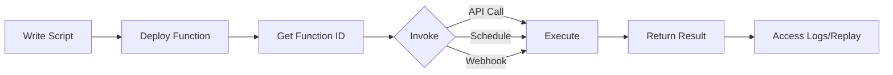

import BasicFunction from "/snippets/functions/basic_function.mdx";
import DeployFunction from "/snippets/functions/deploy_function.mdx";

<iframe
  className="w-full aspect-video rounded-xl"
  src="https://www.youtube.com/embed/jzbsfX-2qzY"
  title="Notte Functions"
  allow="accelerometer; autoplay; clipboard-write; encrypted-media; gyroscope; picture-in-picture"
  allowFullScreen
></iframe>

Functions are serverless deployments of your browser automations that can be invoked via API, scheduled to run automatically, or triggered by events.

## What are Functions?

Functions turn your automation scripts into:
- **API endpoints** you can call with HTTP requests
- **Scheduled jobs** that run on a cron schedule
- **Reusable workflows** accessible from anywhere
- **Shareable automations** for your team

Unlike running scripts locally, Functions:
- ✅ Run on Notte's infrastructure (no servers to manage)
- ✅ Scale automatically based on demand
- ✅ Provide built-in logging and monitoring
- ✅ Can be invoked from any platform (Python, JavaScript, cURL, etc.)
- ✅ Support scheduling and automation

## How Functions Work

### 1. Write Your Script

Create a Python file with a `run()` function:

<BasicFunction />

### 2. Deploy to Notte

Upload your script to create a Function:

<DeployFunction />

### 3. Invoke the Function

Call your Function as an API:

```python
# Via SDK
result = function.run(
    url="https://example.com",
    search_query="laptop"
)

print(result.result)
```

```bash
# Via cURL
curl -X POST https://api.notte.cc/functions/{function_id}/runs/start \
  -H "Authorization: Bearer YOUR_API_KEY" \
  -H "Content-Type: application/json" \
  -d '{
    "function_id": "workflow_123",
    "variables": {
      "url": "https://example.com",
      "search_query": "laptop"
    }
  }'
```

## Function Structure

### The Handler Function

Functions must have a `run()` function that serves as the entry point:

```python
def run(param1: str, param2: int = 10):
    """
    Function docstring explains what it does.

    Args:
        param1: Description of param1
        param2: Description of param2 (optional)

    Returns:
        Description of return value
    """
    # Your automation code
    result = perform_automation(param1, param2)
    return result
```

**Key points:**
- Named `run()` - this is the entry point
- Can accept parameters (passed as `variables` when invoked)
- Should have type hints for clarity
- Should include docstring documentation
- Returns a value (any JSON-serializable type)

### Parameters

Define parameters as arguments to the `run` function:

```python
def run(email: str, password: str, product_id: str):
    client = NotteClient()

    with client.Session() as session:
        session.execute(type="fill", id="email", value=email)
        session.execute(type="fill", id="password", value=password)
        session.execute(type="goto", url=f"https://example.com/product/{product_id}")
```

Pass values when invoking the function:

```python
function.run(
    email="user@example.com",
    password="secret",
    product_id="123"
)
```

### Return Values

Functions can return any JSON-serializable data:

```python
# Return string
def run():
    return "Task completed successfully"

# Return dict
def run():
    return {
        "status": "success",
        "data": extracted_data,
        "count": len(extracted_data)
    }

# Return list
def run():
    return ["item1", "item2", "item3"]

# Return Pydantic model (serialized)
from pydantic import BaseModel

class Result(BaseModel):
    success: bool
    data: list[str]

def run():
    return Result(success=True, data=["a", "b"]).model_dump()
```

## Use Cases

### 1. Scheduled Scraping

Extract data on a schedule:

```python
# price_monitor.py
def run(product_urls: list[str]):
    client = NotteClient()
    prices = []

    for url in product_urls:
        with client.Session() as session:
            session.execute(type="goto", url=url)
            price = session.scrape(
                instructions="Extract product price"
            )
            prices.append({"url": url, "price": price})

    return prices

# Deploy and schedule to run daily
function = client.Function(
    workflow_path="price_monitor.py",
    name="Daily Price Monitor"
)

# Schedule via console: every day at 9 AM
```

### 2. API Endpoints

Expose automation as an API:

```python
# contact_extractor.py
def run(company_url: str):
    client = NotteClient()

    with client.Session() as session:
        session.execute(type="goto", url=company_url)

        contact_info = session.scrape(
            instructions="Extract contact email and phone"
        )

        return contact_info

# Now callable from any service
# GET /functions/{id}/runs/start?variables={"company_url": "..."}
```

### 3. Webhooks

Trigger automations from external events:

```python
# order_processor.py
def run(order_id: str, action: str):
    client = NotteClient()

    with client.Session() as session:
        # Login to admin panel
        session.execute(type="goto", url="https://admin.example.com")

        # Process order
        if action == "fulfill":
            session.execute(
                type="click",
                selector=f"button[data-order='{order_id}'].fulfill"
            )
        elif action == "refund":
            session.execute(
                type="click",
                selector=f"button[data-order='{order_id}'].refund"
            )

    return {"order_id": order_id, "action": action, "status": "completed"}

# Called via webhook from your e-commerce platform
```

### 4. Batch Processing

Process multiple items in parallel:

```python
# bulk_data_extract.py
def run(urls: list[str], max_workers: int = 5):
    from concurrent.futures import ThreadPoolExecutor

    client = NotteClient()

    def extract_from_url(url):
        with client.Session() as session:
            session.execute(type="goto", url=url)
            data = session.scrape()
            return {"url": url, "data": data}

    with ThreadPoolExecutor(max_workers=max_workers) as executor:
        results = list(executor.map(extract_from_url, urls))

    return results
```

## How Functions Fit In

Functions are a **deployment layer** - they turn any automation into a reusable API.

```
┌─────────────────────────────────────────────────────┐
│                     Function                        │
│            (Deployment & Scheduling)                │
├─────────────────────────────────────────────────────┤
│                                                     │
│   ┌─────────────────┐    ┌─────────────────┐       │
│   │ Scripted        │ or │ Agent           │       │
│   │ Automation      │    │ (AI-driven)     │       │
│   └────────┬────────┘    └────────┬────────┘       │
│            │                      │                 │
│            └──────────┬───────────┘                 │
│                       │                             │
│              ┌────────▼────────┐                    │
│              │    Session      │                    │
│              │ (Cloud Browser) │                    │
│              └─────────────────┘                    │
│                                                     │
└─────────────────────────────────────────────────────┘
```

- **Session** - The cloud browser that runs everything
- **Scripted Automation vs Agent** - How you control the session
- **Function** - Deploys your automation as an API with scheduling, versioning, and sharing

**Use Functions when:**
- You need to run automation repeatedly
- You want to expose automation as an API
- You need scheduling capabilities
- You want to share automation with team or customers

Functions can contain either scripted automation or agents - they're not mutually exclusive.

## Function Lifecycle



1. **Write** - Create Python script with `run()` function
2. **Deploy** - Upload to Notte (creates function ID)
3. **Version** - Notte tracks versions automatically
4. **Invoke** - Call via API, schedule, or webhook
5. **Execute** - Runs on Notte infrastructure
6. **Monitor** - View logs, replays, and results

## Best Practices

### 1. Use Clear Parameters

Define parameters with type hints and descriptions:

```python
def run(
    target_url: str,
    max_results: int = 10,
    timeout_seconds: int = 30
):
    """
    Extract data from a website.

    Args:
        target_url: The URL to scrape
        max_results: Maximum number of results to extract
        timeout_seconds: Session timeout
    """
    pass
```

### 2. Return Structured Data

Always return JSON-serializable data:

```python
# Good
return {
    "success": True,
    "data": results,
    "count": len(results),
    "timestamp": datetime.now().isoformat()
}

# Bad - not JSON serializable
return datetime.now()  # Can't serialize datetime
```

### 3. Handle Errors Gracefully

Catch exceptions and return meaningful errors:

```python
def run(url: str):
    try:
        client = NotteClient()
        with client.Session() as session:
            session.execute(type="goto", url=url)
            data = session.scrape()
            return {"success": True, "data": data}
    except Exception as e:
        return {
            "success": False,
            "error": str(e),
            "error_type": type(e).__name__
        }
```

### 4. Add Logging

Log important steps for debugging:

```python
from loguru import logger

def run(url: str):
    logger.info(f"Starting automation for {url}")

    client = NotteClient()
    with client.Session() as session:
        logger.info("Session started")
        session.execute(type="goto", url=url)
        logger.info("Navigation complete")

        data = session.scrape()
        logger.info(f"Extracted {len(data)} items")

    return data
```

## Next Steps

<CardGroup cols={2}>
  <Card title="Creating Functions" icon="file-code" href="/features/functions/creating">
    Learn how to write and deploy Functions
  </Card>

  <Card title="Invocations" icon="play" href="/features/functions/invocations">
    Call Functions via API, SDK, or cURL
  </Card>

  <Card title="Schedules" icon="clock" href="/features/functions/schedules">
    Schedule Functions with cron
  </Card>

  <Card title="Management" icon="sliders" href="/features/functions/management">
    Update, version, and monitor Functions
  </Card>
</CardGroup>
