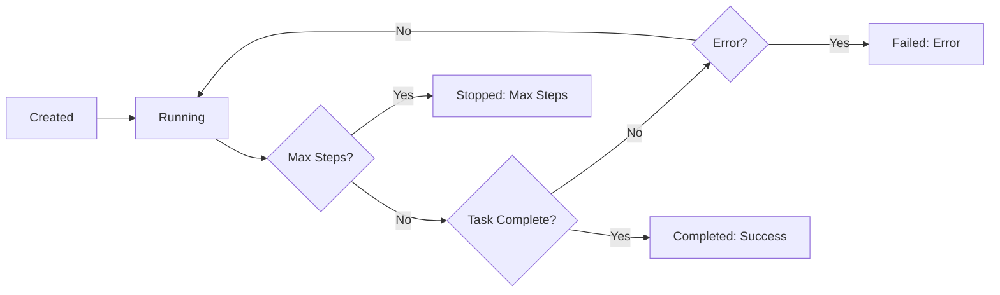

import AsyncExecution from "/snippets/agents/async_execution.mdx";
import ParallelAgents from "/snippets/agents/parallel_agents.mdx";
import RetryPattern from "/snippets/agents/retry_pattern.mdx";

Agents support multiple execution patterns - from simple blocking calls to advanced asynchronous monitoring. Choose the right pattern for your use case.

## Execution Modes

### Run (Blocking)

The simplest way to execute an agent - start and wait for completion:

```python
from notte_sdk import NotteClient

client = NotteClient()

with client.Session() as session:
    agent = client.Agent(session=session, max_steps=10)

    result = agent.run(task="Go to example.com and find the contact email")

    if result.success:
        print(result.answer)
    else:
        print(f"Failed: {result.error}")
```

**When to use:**
- Simple scripts
- Synchronous workflows
- You don't need to do other work while the agent runs

---

### Start + Wait (Non-blocking)

Start the agent and wait for completion separately:

```python
with client.Session() as session:
    agent = client.Agent(session=session)

    # Start agent (returns immediately)
    agent.start(task="Complete this task")

    # Do other work here...

    # Wait for completion
    result = agent.wait()
```

**When to use:**
- You need to start multiple agents in parallel
- You want to do other work while the agent runs
- You need more control over execution

---

### Async Execution

Run agents asynchronously with `async`/`await`:

<AsyncExecution />

**When to use:**
- Building async applications
- Running multiple agents concurrently
- Integrating with async frameworks (FastAPI, aiohttp)

## Agent States

Agents transition through these states during execution:



### Running

Agent is actively executing:

```python
agent.start(task="Complete task")
# Agent state: Running
```

### Completed

Agent successfully finished the task:

```python
result = agent.wait()
if result.success:
    # Agent state: Completed
    print(result.answer)
```

### Failed

Agent encountered an error:

```python
result = agent.wait()
if not result.success:
    # Agent state: Failed
    print(f"Error: {result.error}")
```

### Stopped (Max Steps)

Agent reached maximum step limit:

```python
agent = client.Agent(session=session, max_steps=5)
result = agent.run(task="Very complex task")

if len(result.steps) >= 5:
    # Agent hit max_steps limit
    print("Agent stopped: maximum steps reached")
```

## Monitoring Progress

### Status Checking

Check agent progress at any time:

```python
agent.start(task="Long running task")

# Check status
status = agent.status()

print(f"Agent ID: {status.agent_id}")
print(f"Current state: {status.status}")
print(f"Steps completed: {len(status.steps)}")
print(f"Success: {status.success}")
```

### Live Log Streaming

Stream agent logs in real-time via WebSocket:

```python
async def monitor_agent():
    agent.start(task="Complete task")

    # Stream logs as they happen
    await agent.watch_logs(log=True)

    # Get final status
    status = agent.status()
    return status

asyncio.run(monitor_agent())
```

### Polling Pattern

Check status periodically:

```python
import time

agent.start(task="Long task")

while True:
    status = agent.status()

    if status.status == "closed":
        break

    print(f"Progress: {len(status.steps)} steps completed")
    time.sleep(5)  # Check every 5 seconds

print(f"Final result: {status.success}")
```

## Parallel Execution

### Multiple Independent Agents

Run multiple agents simultaneously:

<ParallelAgents />

### Batch Execution

Use `BatchRemoteAgent` for parallel execution with strategies:

```python
from notte_sdk.endpoints.agents import BatchRemoteAgent

with client.Session() as session:
    batch_agent = BatchRemoteAgent(
        session=session,
        max_steps=10,
        _client=client
    )

    # Run 3 agents in parallel, return first success
    result = await batch_agent.run(
        task="Complete task",
        n_jobs=3,
        strategy="first_success"
    )
```

See [Batch Agents](/features/agents/batch) for details.

## Stopping Agents

### Manual Stop

Stop a running agent:

```python
agent.start(task="Long task")

# Do something...

# Stop the agent
agent.stop()
```

**Note:** You cannot stop agents once they complete a step - they must finish the current action.

### Timeout Pattern

Implement custom timeouts:

```python
import asyncio

async def run_with_timeout(agent, timeout_seconds=60):
    try:
        result = await asyncio.wait_for(
            agent.arun(task="Complete task"),
            timeout=timeout_seconds
        )
        return result
    except asyncio.TimeoutError:
        agent.stop()
        raise TimeoutError(f"Agent exceeded {timeout_seconds}s timeout")

# Run with 60 second timeout
result = asyncio.run(run_with_timeout(agent, timeout_seconds=60))
```

## Response Structure

Agent responses contain execution details:

```python
result = agent.run(task="Extract data")

# Access result properties
print(result.success)      # bool: Did agent succeed?
print(result.answer)       # str: Agent's response
print(result.error)        # str | None: Error message if failed
print(result.steps)        # list: All steps taken
print(result.agent_id)     # str: Unique agent ID
print(result.session_id)   # str: Session used
```

### Step Details

Inspect individual steps:

```python
result = agent.run(task="Navigate and extract")

for i, step in enumerate(result.steps):
    print(f"Step {i+1}:")
    print(f"  Action: {step.action}")
    print(f"  Success: {step.success}")
    print(f"  Message: {step.message}")
```

## Error Handling

### Graceful Degradation

Handle failures gracefully:

```python
result = agent.run(task="Complete task")

if result.success:
    # Process successful result
    process_data(result.answer)
else:
    # Handle failure
    logger.error(f"Agent failed: {result.error}")

    # Fallback strategy
    fallback_approach()
```

### Retry Pattern

Retry failed agents:

<RetryPattern />

### Agent Fallback

Use `AgentFallback` for automatic error recovery:

```python
with client.Session() as session:
    with client.AgentFallback(session, task="Add item to cart") as agent_fb:
        # Try deterministic actions first
        session.execute(type="click", selector="#add-to-cart")
        session.execute(type="click", selector="#checkout")
        # Agent automatically handles any failures

if agent_fb.success:
    print("Task completed (possibly with agent help)")
```

See [Agent Fallback](/features/agents/fallback) for details.

## Best Practices

### 1. Use Appropriate Execution Mode

```python
# Simple tasks: Use run()
result = agent.run(task="Quick task")

# Multiple agents: Use async
results = await asyncio.gather(
    agent1.arun(task="Task 1"),
    agent2.arun(task="Task 2")
)

# Long tasks with monitoring: Use start() + polling
agent.start(task="Long task")
while not done:
    status = agent.status()
    # Update UI, log progress, etc.
```

### 2. Always Check Success

```python
result = agent.run(task="Critical task")

if not result.success:
    # Don't proceed if agent failed
    raise RuntimeError(f"Critical task failed: {result.error}")

# Safe to proceed
process_result(result)
```

### 3. Set Appropriate Step Limits

```python
# Match max_steps to expected complexity
agent = client.Agent(
    session=session,
    max_steps=10  # For tasks requiring 5-8 steps
)
```

### 4. Clean Up Resources

```python
# Use context managers for automatic cleanup
with client.Session() as session:
    agent = client.Agent(session=session)
    result = agent.run(task="Task")
# Session automatically closed
```

## Next Steps

<CardGroup cols={2}>
  <Card title="Configuration" icon="sliders" href="/features/agents/configuration">
    Configure agent parameters
  </Card>

  <Card title="Batch Agents" icon="layer-group" href="/features/agents/batch">
    Run agents in parallel
  </Card>

  <Card title="Agent Fallback" icon="shield" href="/features/agents/fallback">
    Automatic error recovery
  </Card>

  <Card title="Replay" icon="circle-play" href="/features/agents/replay">
    Debug with visual replays
  </Card>
</CardGroup>
